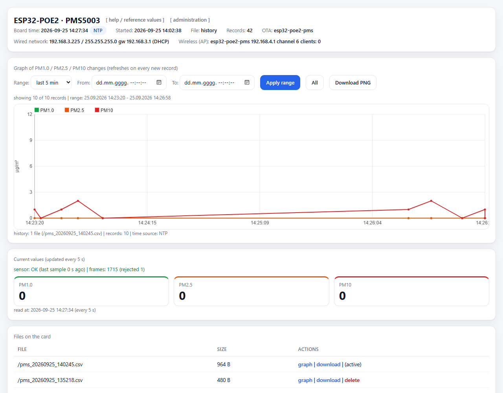

# ESP32-POE2 — PMS5003 logger with web UI and administration

Particulate matter measurement (PM1.0 / PM2.5 / PM10) with a **PMS5003** sensor
on an **Olimex ESP32-POE2**: logging to the onboard microSD card, NTP time,
a web page with a chart, a Wi-Fi access point and device administration.



*Web interface: network status and boot time in the header, chart with range
filters (last 5 min by default, custom from-to range), current values with the
sensor freshness indicator, and the file list with download/delete actions.*

## Hardware

| Part | Details |
|---|---|
| Board | Olimex ESP32-POE2 (ESP32-WROVER-E, 4 MB flash, 8 MB PSRAM) |
| Ethernet | LAN8720: PHY addr 0, MDC=GPIO23, MDIO=GPIO18, POWER=GPIO12, CLK=GPIO0 |
| microSD | onboard slot, 1-bit SDMMC: CLK=GPIO14, CMD=GPIO15, D0=GPIO2 |
| PMS5003 | VCC=5V, GND, TX=GPIO33 (board RX), RX=GPIO13 (board TX, optional) |
| Wi-Fi | softAP, default `esp32-poe2-pms` |

Pins not to use: GPIO16/17 (PSRAM), GPIO18/23 (Ethernet), GPIO12 (PHY power),
GPIO0 (ETH clock), GPIO14/15/2 (SD), GPIO1/3 (USB serial), GPIO34-39 (input only).

> **Power:** the POE2 has no galvanic isolation between PoE power and USB.
> Disconnect the Ethernet cable while programming over USB if the board is
> powered over PoE.

## Features

- PMS5003 is read over `Serial2` (9600 8N1), 32-byte frames with the `0x42 0x4D`
  header and a checksum; the parser re-syncs on the header and counts accepted
  and rejected frames.
- CSV logging **only when PM2.5 or PM10 changes**.
- One file per creation date and time: `/pms_YYYYMMDD_HHMMSS.csv`, with
  **automatic rotation at midnight** and no board restart.
- Time: **NTP** when the network is available, **MANUAL** when set from the
  administration page, otherwise **MILLIS** (always recorded in `time_source`).
- Ethernet (DHCP or static IP) plus a **Wi-Fi access point** (SSID, password,
  channel); web UI and OTA work on both networks.
- Web page: chart with range filters (last 5 min … last 24 h, plus a custom
  from-to range), PNG export, current values, sensor freshness indicator,
  file list with download and delete, a help modal with reference PM values,
  and a header showing wired/wireless network settings and the boot time.
- **Administration** at `/admin`: network settings (Ethernet, AP, NTP) and
  manual time setting. Settings are stored in NVS (`Preferences`) and survive
  a restart; changing network settings restarts the device.
- **OTA** update over the network (ArduinoOTA, hostname `esp32-poe2-pms`).
- Serial output is disabled (`SERIAL_DEBUG 0`).

## CSV format

```
timestamp,time_source,pm1_0,pm2_5,pm10
1789733325,NTP,3,7,7
```

`timestamp` is a Unix epoch (UTC) when the clock has a valid epoch (NTP or
MANUAL), otherwise `millis()`.

## Web endpoints

| Path | Purpose |
|---|---|
| `/` | HTML page with the chart |
| `/admin` | administration (GET shows the form, POST saves) |
| `/api/status` | JSON: time, networks, records, current values, OTA |
| `/api/data?f=` | JSON records of a single file |
| `/api/data?from=&to=` | JSON records across all files covering a range |
| `/api/files` | JSON list of files on the card |
| `/download?f=` | download a file |
| `/delete?f=` | delete a file (the active one is protected) |

## Build and upload

Arduino core 3.3.11 has no board named `esp32-poe2`, so a WROVER target with
PSRAM enabled is used. Because the Wi-Fi library makes the application large
(~1.19 MB), the `min_spiffs` partition scheme (1.9 MB app partition) is
required for comfortable OTA headroom:

```sh
arduino-cli compile --fqbn esp32:esp32:esp32wrover:PartitionScheme=min_spiffs \
    arduino/pms5003_poe2_logger
arduino-cli upload  --fqbn esp32:esp32:esp32wrover:PartitionScheme=min_spiffs \
    -p COM4 arduino/pms5003_poe2_logger
```

OTA (no USB cable needed):

```sh
arduino-cli upload --fqbn esp32:esp32:esp32wrover:PartitionScheme=min_spiffs \
    --protocol network -p <board_IP> arduino/pms5003_poe2_logger
```

## Sketches in this repository

| Sketch | Purpose |
|---|---|
| `arduino/pms5003_poe2_logger` | main sketch: PMS5003 + SD + NTP + web + AP + OTA |
| `arduino/esp32_poe_test` | minimal test: blink + serial output |
| `arduino/esp32_poe_eth_test` | Ethernet test (LAN8720, DHCP) |

## Defaults

| Setting | Default |
|---|---|
| Ethernet | DHCP |
| Wi-Fi AP | enabled, `esp32-poe2-pms`, WPA2 `pms5003pms`, channel 6 |
| NTP server | `pool.ntp.org` |
| Time zone | `CET-1CEST,M3.5.0,M10.5.0/3` (file names and page display only) |
| Chart range | last 5 minutes |
